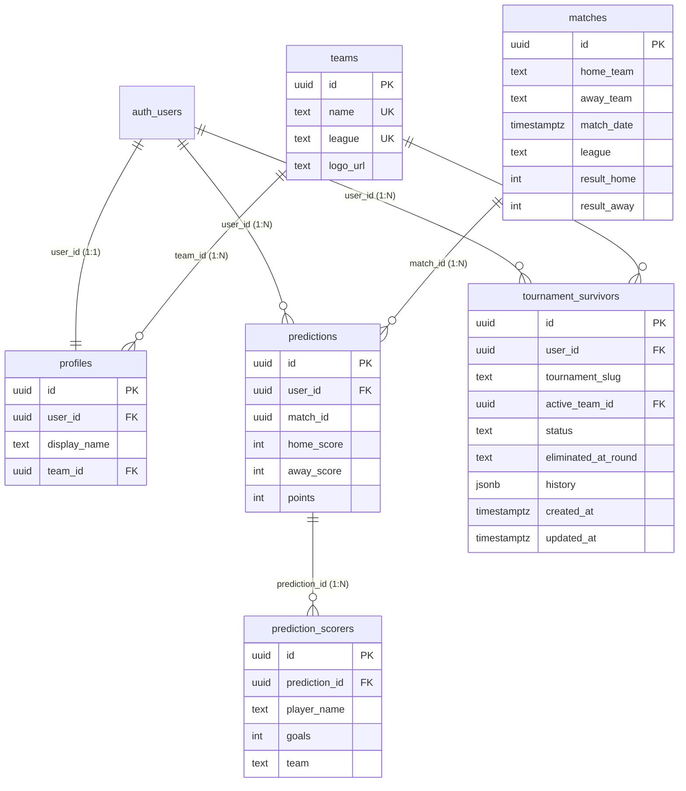

# 📘 Manual de Restauración Total y Recuperación ante Desastres (Disaster Recovery)

Este documento detalla el procedimiento completo paso a paso para **restaurar la plataforma del 4° Concurso Interliga desde cero** en caso de pérdida total del proyecto, eliminación accidental de la base de datos o migración a una nueva cuenta de Supabase.

---

## 📋 Índice
1. [Resumen de Componentes y Estado](#-resumen-de-componentes-y-estado)
2. [Guía Rápida de Restauración en 5 Minutos](#-guía-rápida-de-restauración-en-5-minutos)
3. [Esquema de Base de Datos y Semillas](#-esquema-de-base-de-datos-y-semillas)
4. [Configuración de Seguridad y RLS](#-configuración-de-seguridad-y-rls)
5. [Optimizaciones para el Plan Free de Supabase](#-optimizaciones-para-el-plan-free-de-supabase)
6. [Configuración de Autenticación y Redirects](#-configuración-de-autenticación-y-redirects)
7. [Variables de Entorno y GitHub Secrets](#-variables-de-entorno-y-github-secrets)
8. [Preguntas Frecuentes y Diagnóstico](#-preguntas-frecuentes-y-diagnóstico)

---

## 🧩 1. Resumen de Componentes y Estado

La plataforma está diseñada con una arquitectura resiliente y desacoplada:

| Componente | Fuente / Ubicación | Dependencia Externa | Estrategia de Respaldo |
|---|---|---|---|
| **Frontend Web** | Next.js 16 + React 19 + Tailwind v4 | GitHub Repository | Versionado en Git (`main`) |
| **Base de Datos** | Supabase PostgreSQL | Proyecto Supabase | `supabase/schema.sql` |
| **Autenticación** | Supabase Auth (Email/Pass) | Proyecto Supabase | `auth.users` + Trigger automático |
| **Calendario Oficial** | 1.842 Partidos 2026/27 | `src/data/officialFixtures.json` | Pre-sincronizado localmente |
| **Plantillas Oficiales** | 3.822 Jugadores 2026/27 | `src/data/officialPlayers.json` | Pre-sincronizado localmente |
| **Partidos Evaluados** | Resultados y marcadores oficiales | `src/data/officialEvaluatedMatches.json` | Pre-sincronizado / Versionado |
| **Tablas en Vivo** | ESPN API sin API Key | `src/lib/espnApi.ts` | En vivo / Fallback automático |
| **Scripts de Evaluación** | Evaluador CLI de marcadores y puntos | `scripts/evaluate-matches.js` | Versionado en Git (`main`) |

---

## ⚡ 2. Guía Rápida de Restauración en 5 Minutos

Si se pierde la base de datos de Supabase o se necesita crear un nuevo entorno:

### Paso 1: Crear un nuevo proyecto en Supabase
1. Ingresar a [supabase.com/dashboard](https://supabase.com/dashboard).
2. Crear un nuevo proyecto (ej. `4to-concurso-interliga`).
3. Definir una contraseña segura de base de datos y seleccionar una región cercana (ej. `East US` o `South America`).

### Paso 2: Ejecutar el Script Maestro de Base de Datos
1. En el panel lateral de Supabase, ir a **SQL Editor** $\rightarrow$ **New Query**.
2. Abrir el archivo [`supabase/schema.sql`](./supabase/schema.sql) de este repositorio.
3. Copiar todo el contenido, pegarlo en el editor y hacer clic en **Run**.
4. ✅ Esto creará automáticamente:
   - Las 7 tablas (`teams`, `profiles`, `players`, `matches`, `predictions`, `prediction_scorers`, `tournament_survivors`).
   - Los 15 índices de alta velocidad.
   - Las políticas RLS de lectura y escritura.
   - La función y trigger de registro automático (`handle_new_user`).
   - La función RPC de eliminación de cuenta (`delete_user_account`).
   - Los 89 clubes oficiales con sus escudos y ligas.

### Paso 3: Configurar las Variables de Entorno Locales
1. En Supabase, ir a **Project Settings** $\rightarrow$ **API**.
2. Copiar la **Project URL** y la **Anon Key** (`anon` / `public`).
3. En la raíz de tu proyecto, crear o editar `.env.local`:
   ```env
   NEXT_PUBLIC_SUPABASE_URL=https://tu-nuevo-id.supabase.co
   NEXT_PUBLIC_SUPABASE_ANON_KEY=eyJhbGciOiJIUzI1NiIsInR5cCI6...
   NEXT_PUBLIC_FOOTBALL_DATA_KEY=733c2feed2bf441292e9779c91af2e09
   ```

### Paso 4: Configurar los Secrets de GitHub Actions para el Deploy
1. En tu repositorio de GitHub, ir a **Settings** $\rightarrow$ **Secrets and variables** $\rightarrow$ **Actions**.
2. Actualizar las variables si están configuradas en los Secrets de despliegue.
3. Hacer push a `main` para que GitHub Actions construya y despliegue el sitio en GitHub Pages:
   ```bash
   git push origin main
   ```

---

## 🗄️ 3. Esquema de Base de Datos y Semillas

El esquema relacional completo se encuentra en [`supabase/schema.sql`](./supabase/schema.sql).

### Tabla Resumen del Esquema:

| Tabla | Descripción | Clave Primaria | Relaciones / Claves Foráneas |
|---|---|---|---|
| `teams` | Clubes oficiales de las ligas y torneos | `id` | - |
| `profiles` | Perfiles de participantes y equipo favorito | `id` | `user_id` $\rightarrow$ `auth.users`, `team_id` $\rightarrow$ `teams` |
| `players` | Plantillas de jugadores oficiales | `id` | - |
| `matches` | Partidos oficiales, fechas y marcadores (IDs canónicos de fixtures) | `id` | - |
| `predictions` | Pronósticos de marcadores por participante | `id` | `user_id` $\rightarrow$ `auth.users`, `match_id` $\rightarrow$ `matches` |
| `prediction_scorers` | Goleadores pronosticados por partido | `id` | `prediction_id` $\rightarrow$ `predictions` |
| `tournament_survivors` | Supervivencia y herencia de equipo en torneos KO | `id` | `user_id` $\rightarrow$ `auth.users`, `active_team_id` $\rightarrow$ `teams` |
| `app_meta` | Clave-valor interna (hash del calendario para el cron) | `key` | - |

### Diagrama Entidad-Relación:



### Definición SQL de `tournament_survivors`:

```sql
-- TABLA: tournament_survivors (Estado de supervivencia y herencia de equipo en torneos de eliminación directa)
CREATE TABLE IF NOT EXISTS tournament_survivors (
  id UUID PRIMARY KEY DEFAULT gen_random_uuid(),
  user_id UUID REFERENCES auth.users(id) ON DELETE CASCADE NOT NULL,
  tournament_slug TEXT NOT NULL, -- 'champions', 'europa', 'conference', 'coppaitalia', 'facup', 'copadelrey', 'dfbpokal'
  active_team_id UUID REFERENCES teams(id) NOT NULL,
  status TEXT NOT NULL DEFAULT 'ALIVE' CHECK (status IN ('ALIVE', 'ELIMINATED')),
  eliminated_at_round TEXT,
  history JSONB NOT NULL DEFAULT '[]'::jsonb,
  created_at TIMESTAMPTZ NOT NULL DEFAULT now(),
  updated_at TIMESTAMPTZ NOT NULL DEFAULT now(),
  UNIQUE(user_id, tournament_slug)
);

CREATE INDEX IF NOT EXISTS idx_tournament_survivors_user ON tournament_survivors(user_id);
CREATE INDEX IF NOT EXISTS idx_tournament_survivors_slug ON tournament_survivors(tournament_slug);

ALTER TABLE tournament_survivors ENABLE ROW LEVEL SECURITY;

CREATE POLICY "Lectura pública de tournament_survivors"
  ON tournament_survivors FOR SELECT
  USING (true);

CREATE POLICY "Usuarios administran su estado de torneo"
  ON tournament_survivors FOR ALL
  USING (auth.uid() = user_id)
  WITH CHECK (auth.uid() = user_id);
```

#### Estructura del campo `history` (JSONB) en `tournament_survivors`:
El historial de transferencias almacena las camisetas heredadas al predecir y acertar victorias del rival en fases de eliminación directa:
```json
[
  {
    "from_team": "Real Madrid",
    "to_team": "Manchester City",
    "match_id": "93b2a265-7fe9-4e7a-9a9c-0c4a01c80088",
    "round": "Cuartos de final",
    "date": "2026-04-08T19:00:00Z"
  }
]
```
Módulo de evaluación pura y helpers en `src/lib/survivor.ts`:
- `evaluateSurvivorProgression`: Función pura que computa si el participante se mantiene `ALIVE`, es eliminado a `ELIMINATED` o transfiere su camiseta (`transferred: true`).
- `getUserCupSurvivors(userId)`: Obtiene los estados del participante en las 4 copas con JOIN a `teams(name, logo_url)`.
- `setInitialCupSurvivor(userId, tournamentSlug, teamId)`: Inicializa el club representante.
- `updateCupSurvivor(survivor)`: Guarda progresiones y transferencias.

---

## 🛡️ 4. Configuración de Seguridad y RLS

Todas las tablas cuentan con **Row Level Security (RLS)** para proteger los datos mientras permiten la experiencia multiusuario en tiempo real:

1. **`profiles`:**
   - `SELECT`: Público (`USING (true)`) para que el Ranking muestre a todos los participantes.
   - `INSERT` / `UPDATE`: Restringido al propio usuario (`auth.uid() = user_id`).
2. **`predictions`:**
   - `SELECT`: Público (`USING (true)`) para el cálculo de clasificaciones y puntos.
   - `INSERT` / `UPDATE`: Restringido al propio usuario (`auth.uid() = user_id`).
3. **`prediction_scorers`:**
   - `SELECT`: Público (`USING (true)`) para el ranking y el cron.
   - `INSERT` / `UPDATE` / `DELETE`: Solo el dueño del pronóstico (política con `EXISTS` sobre `predictions` — IDOR fix).
4. **`teams`, `players`, `matches`:**
   - `SELECT`: Público (`USING (true)`).
5. **`tournament_survivors`:**
   - `SELECT`: Público (`USING (true)`).
   - `ALL`: Restringido al propio usuario (`auth.uid() = user_id`).
6. **`app_meta`:**
   - Sin grants para `anon`/`authenticated` — solo accesible por la service role key (el cron la usa para el hash del calendario).

> **Importante:** No existen RPCs públicos de escritura. El cron escribe en `matches`, `predictions`, `prediction_scorers` (no escribe), `tournament_survivors` y `app_meta` con la **service role key** vía REST directo (bypass RLS). Cualquier intento de escritura con la anon key desde el cliente es rechazado por RLS.

---

## 🚀 5. Optimizaciones para el Plan Free de Supabase

Para garantizar un rendimiento ultra-rápido y costo $0:

1. **Índices B-Tree Estratégicos:**
   - `idx_profiles_user_id`, `idx_profiles_team_id`
   - `idx_predictions_user_match` (Índice compuesto en `user_id, match_id`)
   - `idx_matches_date`, `idx_matches_home`, `idx_matches_away`
   - `idx_tournament_survivors_user`, `idx_tournament_survivors_slug`
2. **Caché en Cliente (60s TTL):**
   - El ranking utiliza caché en memoria para evitar saturar la base de datos con peticiones repetitivas.
3. **Zero DB Reads en Plantillas:**
   - 3.822 jugadores pre-cargados en bundle en memoria (`officialPlayers.json`).
4. **Cron liviano (~2MB/mes de egress):**
   - El sync del calendario (1.842 fixtures) solo corre cuando cambia `officialFixtures.json` (hash md5 en `app_meta`).
   - La persistencia de resultados usa los IDs canónicos directos (sin descargar la tabla `matches` completa en cada corrida).
5. **Mantenimiento de actividad:**
   - El cron cada 2h mantiene el proyecto despierto (el plan Free pausa tras 7 días sin actividad).

---

## 📧 6. Configuración de Autenticación y Redirects

En el panel de Supabase $\rightarrow$ **Authentication**:

1. **URL Configuration:**
   - **Site URL:** `https://juancito8812.github.io/4to-Concurso-Interliga/`
   - **Redirect URLs:**
     - `http://localhost:3000/**`
     - `https://juancito8812.github.io/4to-Concurso-Interliga/**`
     - `https://juancito8812.github.io/4to-Concurso-Interliga/actualizar-contrasena/`

2. **Email Templates (Opcional):**
   - Confirm signup & Reset Password: Asegurarse de que el enlace dirija a `{{ .SiteURL }}/actualizar-contrasena/`.

---

## 🛠️ 7. Funciones y Escrituras Automatizadas

### Eliminación Completa de Cuenta (`delete_user_account`):
Ejecuta la purga en cascada de predicciones, goleadores, tournament_survivors, perfil y elimina la fila de `auth.users`, liberando el email de forma inmediata. Solo ejecutable por usuarios autenticados (`GRANT EXECUTE TO authenticated`):

```sql
CREATE OR REPLACE FUNCTION public.delete_user_account()
RETURNS void
LANGUAGE plpgsql
SECURITY DEFINER
SET search_path = public, pg_temp
AS $$
DECLARE
  v_user_id uuid;
BEGIN
  v_user_id := auth.uid();
  IF v_user_id IS NULL THEN
    RAISE EXCEPTION 'Not authenticated';
  END IF;

  DELETE FROM public.prediction_scorers 
  WHERE prediction_id IN (
    SELECT id FROM public.predictions WHERE user_id = v_user_id
  );
  DELETE FROM public.predictions WHERE user_id = v_user_id;
  DELETE FROM public.tournament_survivors WHERE user_id = v_user_id;
  DELETE FROM public.profiles WHERE user_id = v_user_id;
  DELETE FROM auth.users WHERE id = v_user_id;
END;
$$;
```

### Escrituras del Cron (service role key, NO RPCs públicos):
El cron `scripts/auto-sync-espn-results.js` escribe vía REST directo con `SUPABASE_SERVICE_ROLE_KEY` (GitHub Secret):

| Operación | Endpoint REST |
|---|---|
| Upsert de calendario (solo si cambió el hash) | `POST /rest/v1/matches?on_conflict=id` + `app_meta` |
| Resultados de partidos (solo filas sin resultado) | `PATCH /rest/v1/matches?id=eq.<id>` |
| Puntos de pronósticos | `PATCH /rest/v1/predictions?id=eq.<id>` |
| Progresión de survivors | `PATCH /rest/v1/tournament_survivors?id=eq.<id>` |

> **Seguridad:** Los RPCs públicos de escritura (`update_match_results`, `update_prediction_points`, etc.) fueron ELIMINADOS porque cualquier cliente con la anon key podía manipular puntos (vulnerabilidad verificada y cerrada).

---

## ❓ 8. Preguntas Frecuentes y Diagnóstico

### ¿Qué hacer si en el Ranking los usuarios solo se ven a sí mismos?
- Ejecutar la sección de políticas RLS del archivo `supabase/schema.sql` en el SQL Editor para garantizar que `profiles` tenga la política `Public profiles are viewable by everyone`.

### ¿Cómo verificar que la base de datos está saludable?
- Ejecutar en el SQL Editor:
  ```sql
  SELECT count(*) as total_equipos FROM public.teams;
  SELECT count(*) as total_perfiles FROM public.profiles;
  ```
  Debe retornar 89 equipos y el total de perfiles activos.
